# Pizza Ordering App

Welcome to the Pizza Ordering App, built with React Native, Supabase, and Expo. This application allows users to order pizza seamlessly with a rich set of features and an easy-to-use interface. Below you'll find details about the features, setup, and usage of the app.

## Features

- **Shopping Cart**: Users can add products to a shopping cart and manage their order before checkout.
- **Type-Safe Components**: Utilizes TypeScript for type safety across all components, improving reliability and maintainability.
- **Expo Router**: Efficient routing and navigation within the app using Expo Router.
- **Product Detail Screens**: Detailed screens showcasing individual products with relevant information.
- **Admin Side**:
  - **Create Product**: Admins can add new products to the inventory.
  - **Update Product**: Admins can update existing product details.
  - **Delete Product**: Admins can remove products from the inventory.
- **Authentication**: Secure user authentication with Supabase.
- **Product CRUD**: Full Create, Read, Update, and Delete (CRUD) functionality for products.
- **Orders CRUD**: Manage orders with Create, Read, Update, and Delete functionalities.
- **Real-Time Data**: Real-time data updates using subscriptions with Supabase.
- **Storage**: Handling of media and other assets through Supabase Storage.
- **EAS Configuration**: Configured with Expo Application Services (EAS) for build and deployment management.
- **Push Notifications**: Integrated push notifications to alert users about updates and promotions.
- **Remote Push Notifications**: Supports sending remote push notifications for real-time updates.

## Getting Started

To get started with the Pizza Ordering App, follow the steps below:

### Prerequisites

- Node.js (>= 14.x)
- Expo CLI
- Yarn or npm
- Supabase Account
- TypeScript

### Installation

1. **Clone the Repository**

   ```bash
   git clone https://github.com/yourusername/pizza-ordering-app.git
   cd pizza-ordering-app

 
## Set Up Supabase

2. **Set Up Supabase**

   1. **Create a new project in Supabase**:
      - Go to [Supabase](https://supabase.com/) and sign in or create an account.
      - Create a new project from the Supabase dashboard.

   2. **Copy the `supabaseUrl` and `supabaseKey`**:
      - Navigate to your project's settings in the Supabase dashboard.
      - Find and copy the `supabaseUrl` and `supabaseKey` from the API section.

   3. **Create a `.env` file in the root of your project and add the following**:

      ```bash
      SUPABASE_URL=your_supabase_url
      SUPABASE_KEY=your_supabase_key
      ```


3. **Install Dependencies**

Install the project dependencies using either Yarn or npm:

```bash
yarn install
# or
npm install
```

4. **Run the App**
Start the Expo development server with:

```bash
npx expo start -c
```

## Screenshots

### User Interface

Here is a screenshot of the user interface:

<div style="display: flex; flex-wrap: wrap; gap: 10px;">
  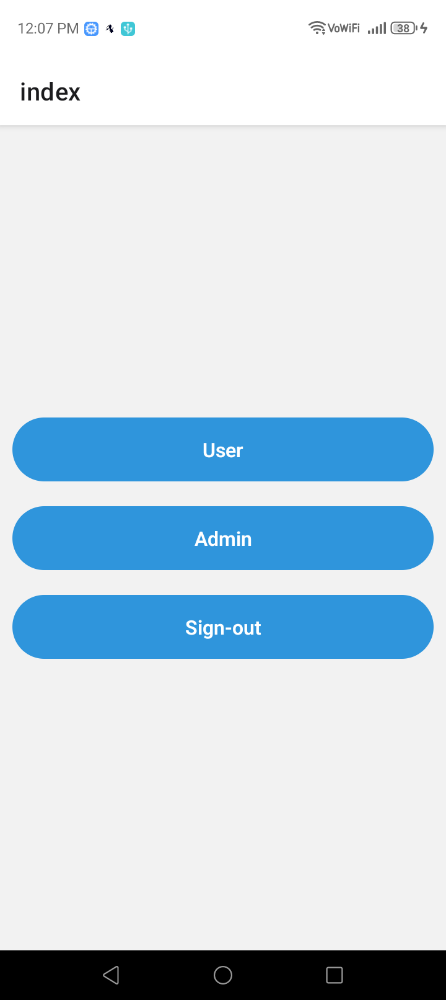
  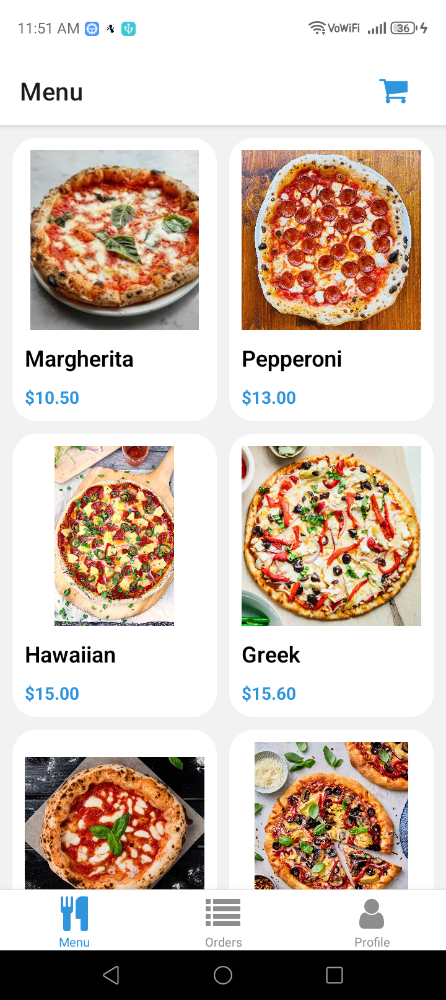
  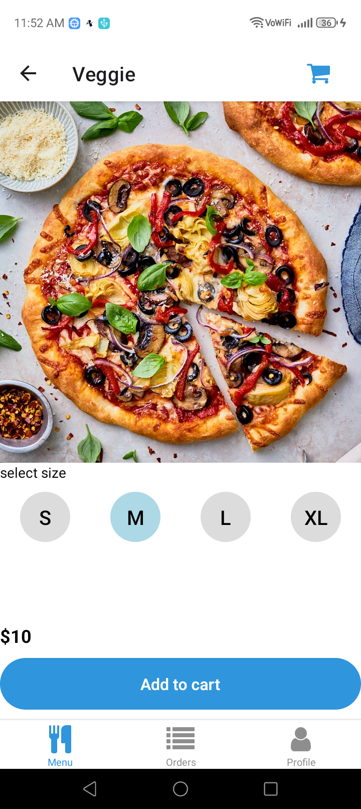
  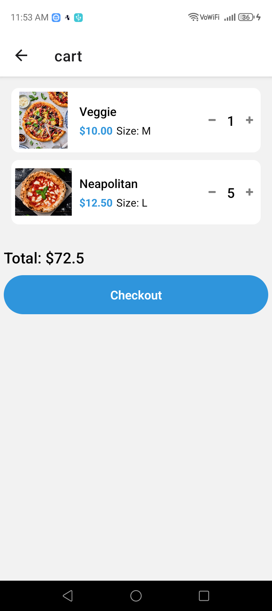
  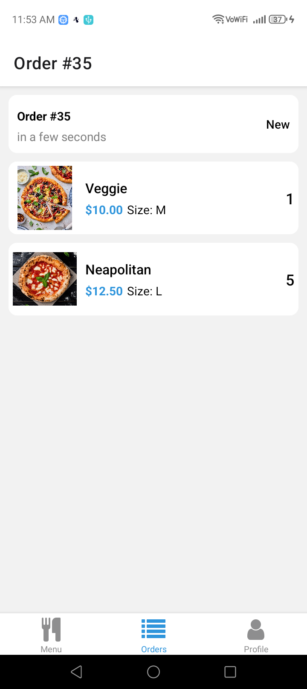
  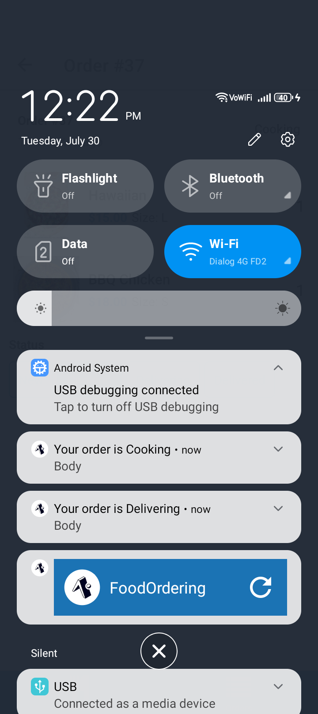
</div>

### Admin Interface

Here is a screenshot of the admin interface:

<div style="display: flex; flex-wrap: wrap; gap: 10px;">
  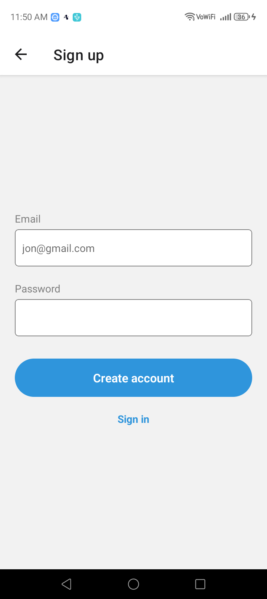
  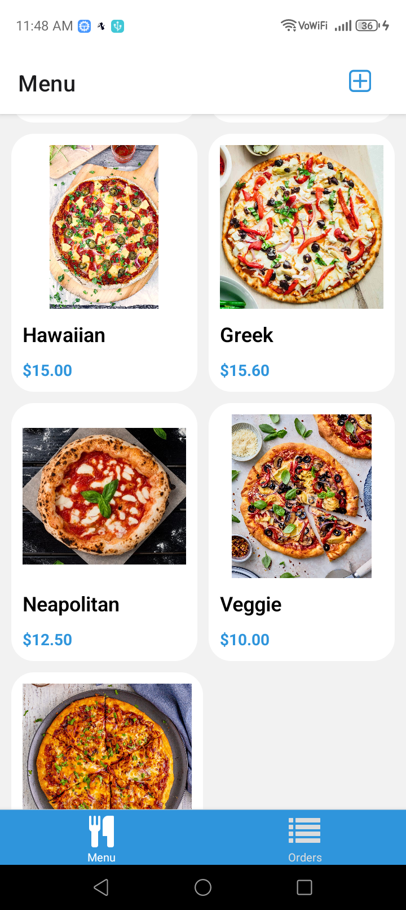
  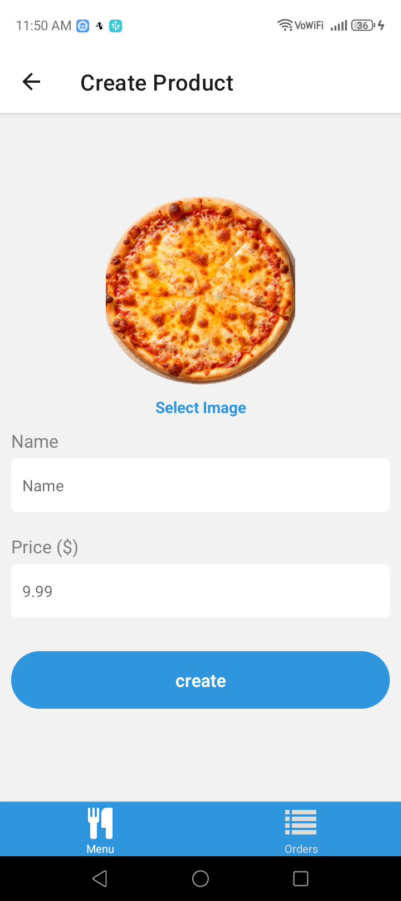
  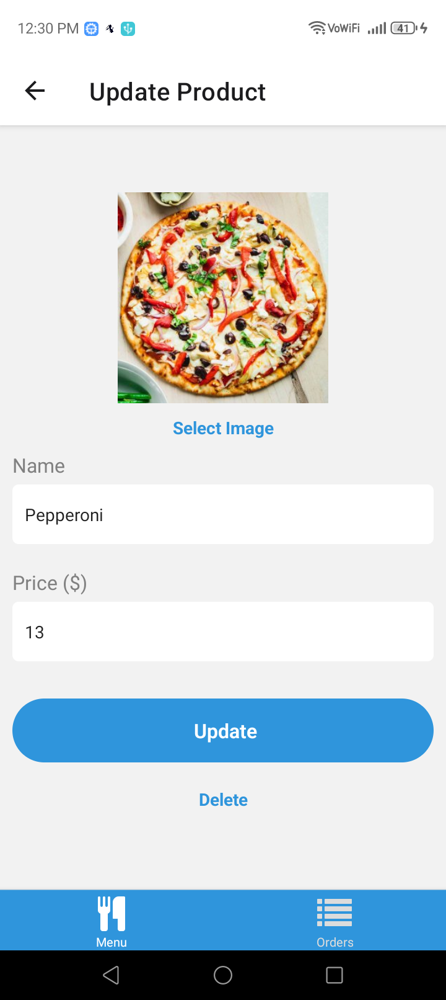
  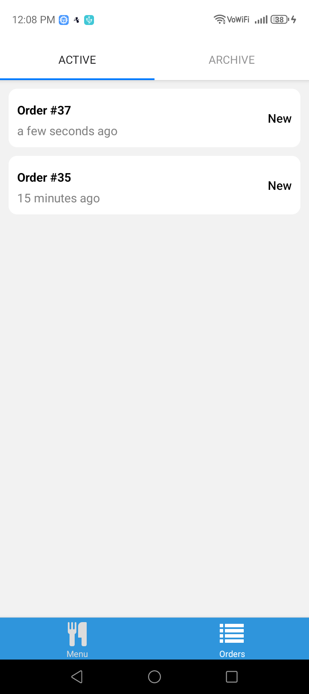
  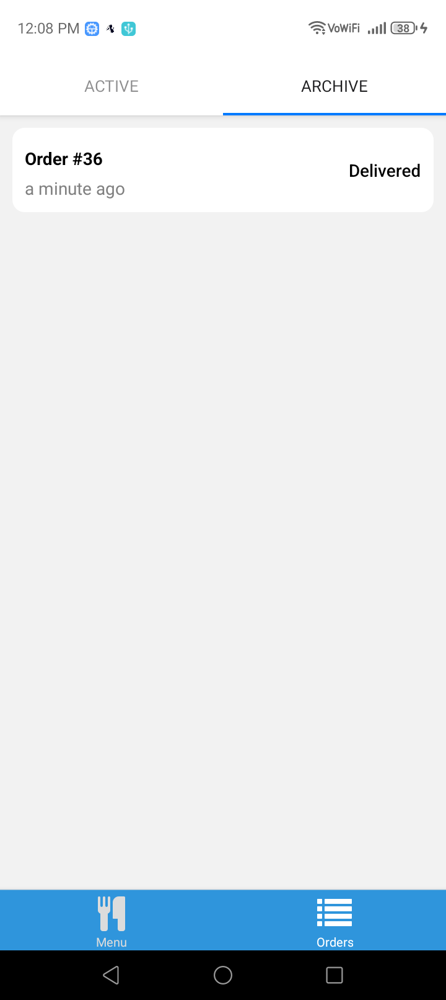
  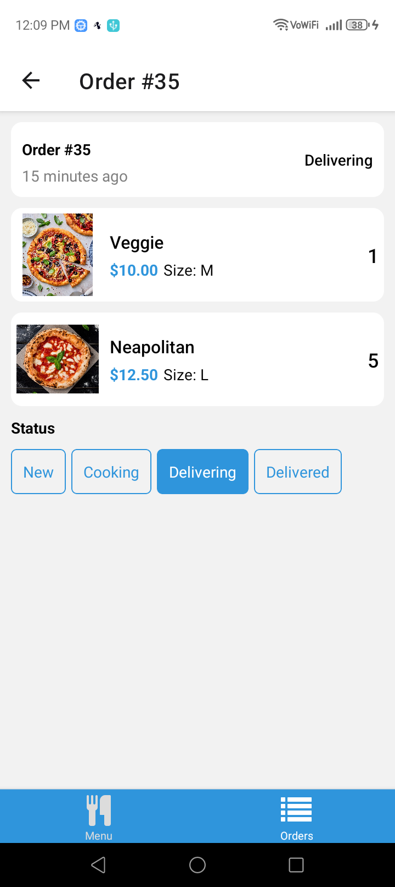
</div>

